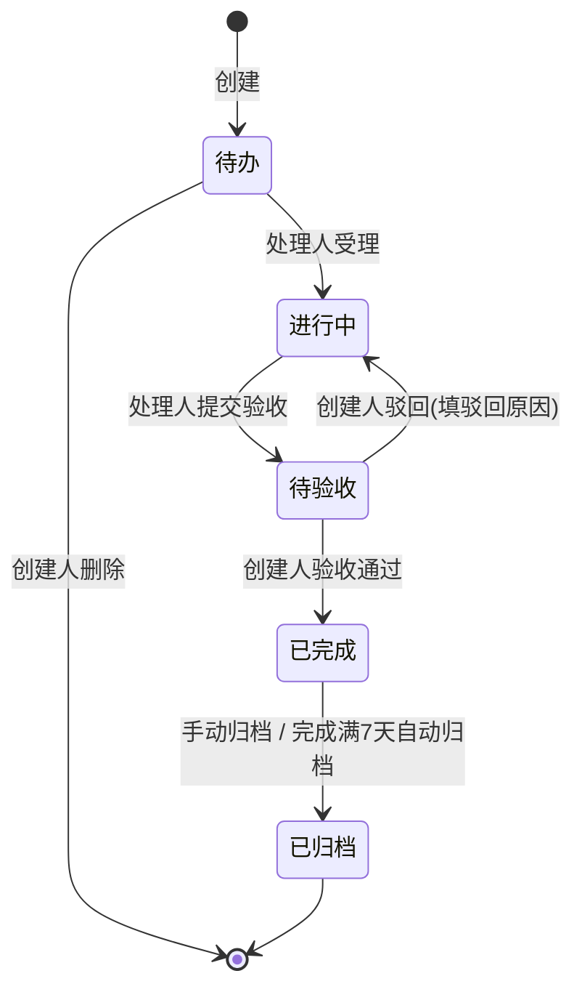
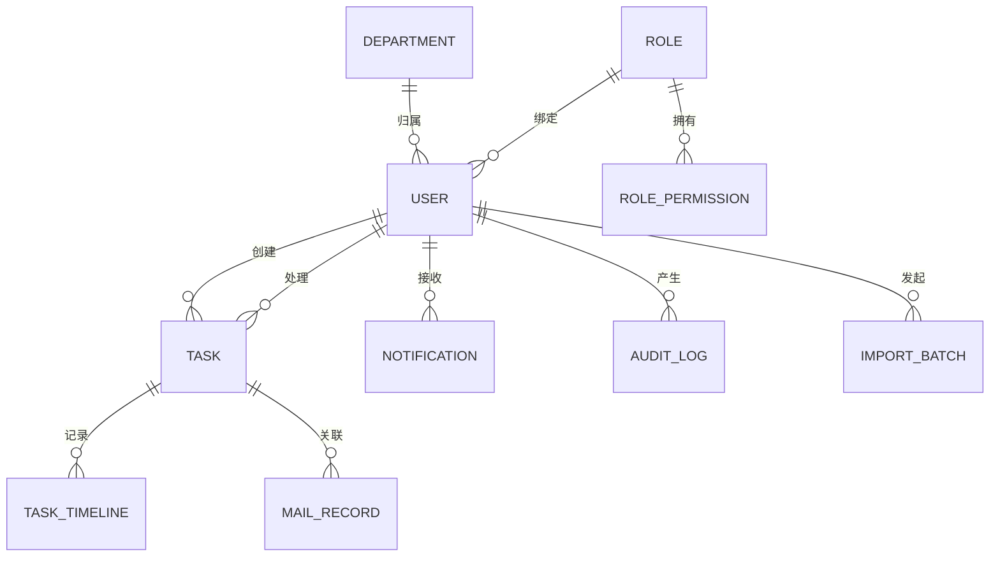
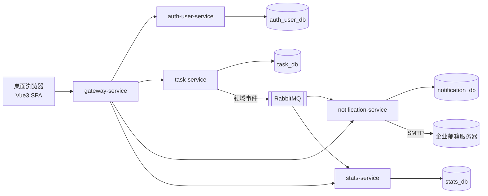

# 任务管理系统 产品需求文档（PRD）

> 版本：v1.0 · 状态：待评审
> 关联原型：[`docs/任务管理系统原型.html`](任务管理系统原型.html)（交互与视觉以原型为基准，需求以本文档为准）
> 关联选型：[`docs/项目skills选型.md`](项目skills选型.md)

---

## 1. 文档信息

### 1.1 阅读对象

| 读者 | 关注章节 |
|---|---|
| 产品负责人 | 2、4、9、10 |
| 前端开发 | 3、4、6、7 |
| 后端开发 | 3、4、5、6、7、8 |
| 测试 | 4、10 |
| 架构师 | 5、6、8 |

### 1.2 术语表

| 术语 | 定义 |
|---|---|
| 任务 | 系统的核心业务对象，全局唯一编号 `TSK-` + 自增序列 |
| 创建人 | 创建任务的用户，负责任务的验收与驳回 |
| 处理人 | 被指派对任务进行处理的用户，负责受理、更新进度、提交验收 |
| RBAC | 基于角色的访问控制：用户绑定角色，角色绑定权限点 |
| 权限点 | 最小授权单元，系统共 14 个，见 3.2 |
| 逾期 | 任务处于未完成状态（待办/进行中/待验收）且当前时间晚于到期时间 |
| 验收 | 创建人对处理人提交的成果进行确认，通过则任务完成 |
| 归档 | 任务的终态，归档后任务只读 |
| 站内消息 | 系统内通知中心的消息，与邮件并行触达 |

---

## 2. 项目概述

### 2.1 背景

企业内部的任务分派与跟踪依赖口头、群消息和表格，存在三个问题：任务归属与进度不透明、逾期无人跟进、工作量无法量化统计。本系统提供统一的任务创建、流转、提醒、统计与权限管理能力。

### 2.2 目标

1. 任务全生命周期在线化：创建、指派、受理、进度跟踪、验收、归档。
2. 任务责任到人：每个任务有且仅有明确的一个创建人与一个处理人。
3. 数据可度量：提供任务总量、逾期、按时完成率、人员负载等统计口径。
4. 权限可控：按角色控制数据可见范围与操作能力，权限矩阵可在线配置。

### 2.3 范围

一期全量交付，覆盖原型的全部功能域：

- 任务管理（CRUD、状态流转、转派、进度、操作时间线）
- 任务列表与筛选（含 CSV 导出）
- 统计总览（KPI 与图表，多时间区间）
- 日程视图（月历）
- 权限管理（用户、角色、权限矩阵）
- 通知中心（站内消息 + 邮件）
- Excel 导入与 OpenAPI 接入

明确的排除项见第 9 章。

### 2.4 成功指标

| 指标 | 口径 | 目标 |
|---|---|---|
| 任务线上化率 | 系统内任务数占部门任务总量的比例（上线后由各部门自查上报） | 上线 3 个月内 ≥ 80% |
| 任务按时完成率 | 见 4.3 的 KPI 口径 | 稳定 ≥ 85% |
| 逾期任务跟进率 | 逾期任务在逾期后 3 个工作日内有进度更新或转派的比例 | ≥ 90% |
| 系统可用性 | 见 7.2 | ≥ 99.5% |

### 2.5 决策基线

以下决策已经确认，作为本 PRD 的约束条件：

| # | 决策点 | 结论 |
|---|---|---|
| 1 | 部署形态 | 单一企业内部使用，不做多租户 |
| 2 | 认证与组织 | 系统自建账号体系，账号密码登录，用户与部门在权限模块内维护 |
| 3 | 数据库 | PostgreSQL |
| 4 | 通知渠道 | 站内消息 + 邮件（SMTP 对接企业邮箱） |
| 5 | 交付范围 | 一期全量交付 |
| 6 | 后端架构 | Spring Cloud 微服务多服务 |
| 7 | 规模指标 | 按通用企业级指标设计，不绑定具体用户量级 |
| 8 | 终端 | 仅桌面 Web，Chrome/Edge 主流版本，设计宽度 1280px 及以上 |

---

## 3. 角色与权限

### 3.1 预置角色

系统预置 3 个角色，一期不支持自定义角色（权限矩阵可配置，角色集合固定）：

| 角色键 | 名称 | 定位 |
|---|---|---|
| `admin` | 系统管理员（超管理员） | 默认拥有全部权限点与全部任务可见性，可操作所有任务，负责系统配置与权限管理；不参与任务处理，不可被指派为处理人 |
| `taskAdmin` | 任务管理员 | 默认可创建任务，仅可见与自己相关的任务，可被指派为处理人 |
| `user` | 普通用户 | 默认不可创建任务，仅可见与自己相关的任务，可被指派为处理人 |

### 3.2 权限点定义（14 个）

| 权限点 | 名称 | 分组 | 说明 |
|---|---|---|---|
| `viewAll` | 查看全部任务 | 任务 | 任务列表可见全部任务 |
| `create` | 创建任务 | 任务 | 新建任务、Excel 导入 |
| `editOwn` | 编辑自己的任务 | 任务 | 编辑本人创建的任务；同时决定本人创建任务的可见性 |
| `deleteOwn` | 删除自己的任务 | 任务 | 删除本人创建且处于待办状态的任务 |
| `transferOwn` | 转派自己的任务 | 任务 | 转派本人创建的任务 |
| `prioOwn` | 调整自己任务优先级 | 任务 | 调整本人创建的任务的优先级 |
| `dueOwn` | 调整自己任务到期时间 | 任务 | 调整本人创建的任务的到期时间 |
| `viewAssigned` | 查看指派给我的 | 任务 | 任务列表可见本人为处理人的任务 |
| `updateAssigned` | 更新指派给我的进度 | 任务 | 受理、更新进度、提交验收 |
| `transferAssigned` | 转派指派给我的 | 任务 | 转派本人为处理人的任务 |
| `viewStats` | 查看统计总览 | 数据 | 访问统计总览模块 |
| `exportData` | 导出数据 | 数据 | CSV 导出 |
| `manageUser` | 用户与角色管理 | 系统 | 用户增改停用、重置密码、角色指派 |
| `setPerm` | 配置权限矩阵 | 系统 | 修改角色与权限点的绑定关系 |

### 3.3 默认权限矩阵

| 权限点 | admin | taskAdmin | user |
|---|:-:|:-:|:-:|
| viewAll | ✔ | | |
| create | ✔ | ✔ | |
| editOwn | ✔ | ✔ | |
| deleteOwn | ✔ | ✔ | |
| transferOwn | ✔ | ✔ | |
| prioOwn | ✔ | ✔ | |
| dueOwn | ✔ | ✔ | |
| viewAssigned | ✔ | ✔ | ✔ |
| updateAssigned | ✔ | ✔ | ✔ |
| transferAssigned | ✔ | ✔ | ✔ |
| viewStats | ✔ | ✔ | |
| exportData | ✔ | ✔ | |
| manageUser | ✔ | | |
| setPerm | ✔ | | |

默认矩阵的角色语义：

1. 普通用户：默认不可创建任务，仅可见与自己相关的任务，可被指派为处理人。
2. 任务管理员：默认可创建任务，仅可见与自己相关的任务，可被指派为处理人；保留统计与导出权限，但统计与导出的数据范围受 3.4 可见性规则约束，仅覆盖与其相关的任务。
3. 超管理员：默认拥有全部权限点与全部任务可见性；名称含"自己"的权限点（editOwn、deleteOwn、transferOwn、prioOwn、dueOwn）对 admin 不受归属限制，可对任意任务行使，包括代创建人执行验收通过与驳回。

如需放开普通用户的创建权限或 taskAdmin 的全局可见性，由系统管理员在权限矩阵中开启对应权限点。

### 3.4 数据可见性规则

任务对当前用户可见，当且仅当满足以下任一条件：

1. 用户角色为 `admin`；
2. 用户角色拥有 `viewAll` 权限点；
3. 用户角色拥有 `viewAssigned` 权限点，且用户是该任务的处理人；
4. 用户角色拥有 `editOwn` 权限点，且用户是该任务的创建人。

可见性规则适用于任务列表、日程、统计总览等所有数据出口；服务端接口必须逐请求校验，不依赖前端隐藏。

### 3.5 权限控制要求

1. 所有受权限点保护的操作，前端按权限隐藏或禁用入口，后端接口做独立鉴权。
2. 无权限操作时，界面给出拒绝原因提示（提示文案指明缺少的权限与当前角色）。
3. "自己"类权限点（editOwn、deleteOwn、transferOwn、prioOwn、dueOwn）的归属判定：admin 角色对任意任务生效；其余角色仅限本人创建的任务。
4. 删除任务的前置状态恒为待办，任何角色（含 admin）不得删除进行中及以后状态的任务。
5. 权限矩阵的每次修改写入审计日志（操作人、时间、修改前后的矩阵差异），见 4.5.4。

---

## 4. 功能需求

### 4.1 任务管理

#### 4.1.1 任务字段

| 字段 | 类型 | 必填 | 约束 | 说明 |
|---|---|---|---|---|
| 编号 | 字符串 | 系统生成 | `TSK-` + 全局自增序列 | 创建后不可变 |
| 标题 | 字符串 | ✔ | 1 至 100 字符 | |
| 描述 | 文本 | | ≤ 2000 字符 | 背景、目标与验收标准 |
| 任务类型 | 枚举 | ✔ | 项目开发 / 日常事务 / 会议事项 / 调研分析 / 数据报表 / 流程审批 | 默认"项目开发" |
| 优先级 | 枚举 | ✔ | P0 紧急 / P1 高 / P2 中 / P3 低 | 默认 P2 |
| 状态 | 枚举 | 系统维护 | 见 4.1.2 状态机 | 创建后为待办 |
| 创建人 | 用户引用 | 系统生成 | 取当前登录用户 | 不可变更 |
| 处理人 | 用户引用 | ✔ | 角色为 taskAdmin 或 user 的在职用户 | admin 不可作为处理人 |
| 创建时间 | 时间戳 | 系统生成 | | |
| 到期时间 | 时间戳 | ✔ | 日期 + 时间（精确到分钟） | 默认创建后第 3 天 18:00 |
| 进度 | 整数 | ✔ | 0 至 100，步进 5 | 默认 0 |
| 来源渠道 | 枚举 | 系统生成 | 网页 / Excel 导入 / OpenAPI | 预留扩展值：企微同步、会议指派、邮件转办 |
| 更新时间 | 时间戳 | 系统维护 | 每次状态或字段变更刷新 | |

#### 4.1.2 任务状态机

状态键与展示名：`new` 待办、`doing` 进行中、`wait` 待验收、`done` 已完成、`close` 已归档。

流转规则：

| 操作 | 前置状态 | 目标状态 | 操作人 | 所需权限点 |
|---|---|---|---|---|
| 受理 | 待办 | 进行中 | 处理人 | updateAssigned |
| 提交验收 | 进行中 | 待验收 | 处理人 | updateAssigned |
| 验收通过 | 待验收 | 已完成 | 创建人（admin 可代执行） | editOwn |
| 验收驳回 | 待验收 | 进行中 | 创建人（admin 可代执行） | editOwn，驳回原因必填（≤ 500 字符） |
| 手动归档 | 已完成 | 已归档 | 拥有 viewAll 权限的用户（默认仅 admin） | viewAll |
| 自动归档 | 已完成满 7 天 | 已归档 | 系统定时任务（每日执行一次） | 无 |
| 删除 | 待办 | （删除） | 创建人（admin 可代执行） | deleteOwn，需二次确认 |

补充规则：

1. 进度更新不改变状态；进度达到 100% 不会自动流转，处理人须显式提交验收。
2. 处理人更新进度（updateAssigned）时，状态为待办则自动流转为进行中（视为受理）。
3. 已归档任务只读，不允许任何编辑、转派、删除操作。
4. 删除为物理删除，删除动作写入审计日志。

#### 4.1.3 任务操作清单

| 操作 | 说明 | 权限点 | 通知 |
|---|---|---|---|
| 创建 | 表单见原型新建弹窗；创建成功后指派生效 | create | 通知处理人 |
| 编辑 | 编辑标题、描述、类型、优先级、处理人、到期时间、进度 | editOwn（本人创建） | 变更处理人时通知新处理人 |
| 删除 | 见 4.1.2 | deleteOwn | 无 |
| 转派 | 将任务转派给其他可担任处理人的用户，需填转派说明（≤ 200 字符） | transferOwn / transferAssigned | 通知新处理人 |
| 调整优先级 | 行内快捷操作 | prioOwn | 无 |
| 调整到期时间 | 行内快捷操作 | dueOwn | 无 |
| 更新进度 | 详情抽屉内更新进度与进展说明 | updateAssigned | 无 |
| 查看详情 | 抽屉展示全部字段、操作时间线、相关通知记录 | 可见性规则 | 无 |

#### 4.1.4 操作时间线

每个任务维护不可篡改的操作时间线，按时间倒序展示。时间线条目包含：时间、操作人、动作、备注。

必录动作：创建任务、受理任务、更新进度（含进度值与进展说明）、转派任务（含原处理人与新处理人）、调整优先级、调整到期时间、提交验收、验收通过、验收驳回（含原因）、手动归档、自动归档。

时间线只增不改，任何入口不得提供编辑或删除时间线记录的能力。

### 4.2 任务列表与筛选

#### 4.2.1 筛选维度

| 筛选项 | 取值 | 说明 |
|---|---|---|
| 关键字 | 自由文本 | 匹配编号、标题、描述、创建人姓名、处理人姓名 |
| 状态 | 5 种状态枚举 | 单选 |
| 优先级 | P0 至 P3 | 单选 |
| 任务类型 | 6 种类型枚举 | 单选 |
| 创建人 | 全部在职用户 | 单选 |
| 处理人 | 可担任处理人的用户 | 单选 |
| 范围 | 全部 / 我创建的 / 指派给我的 / 已逾期 | 快捷切换，与其他筛选条件叠加 |

所有筛选条件之间为与（AND）关系，且始终先经过 3.4 的可见性规则过滤。

#### 4.2.2 列表列与交互

- 列：编号、标题、类型、优先级、状态、创建人、处理人、到期时间、进度、更新时间。
- 逾期任务的到期时间以红色标记。
- 默认按创建时间倒序排列；分页每页 10 / 20 / 50 可选。
- 行内快捷操作：调整优先级、调整到期时间、转派、打开详情抽屉；各操作按权限点启用或禁用。
- 顶部操作：新建任务（`create`）、导出 CSV（`exportData`）。
- 导航"任务列表"入口显示角标：当前用户可见范围内待办 + 进行中的任务数。

#### 4.2.3 CSV 导出

1. 导出内容为当前筛选结果（含可见性过滤），字段与列表列一致，另含描述。
2. 单次导出上限 10000 行，超出时提示缩小筛选范围。
3. 导出文件编码 UTF-8 with BOM，文件名格式：`任务导出-YYYYMMDD-HHmm.csv`。
4. 需要 `exportData` 权限点。

### 4.3 统计总览

访问本模块需要 `viewStats` 权限点；无权限时展示无权限占位提示。

#### 4.3.1 统计区间

四种区间，默认"历史累计"：

| 区间 | 定义 |
|---|---|
| 历史累计 | 全部数据，展示最早创建时间至最新更新时间 |
| 本月 | 本月 1 日 00:00 至今天 |
| 本周 | 本周一 00:00 至本周日（周一为一周起始） |
| 自定义 | 自选起止日期，起止均含当日 |

区间过滤口径：以任务的创建时间落入区间为准。页面需展示当前生效的区间说明文案。

#### 4.3.2 KPI 指标（6 项）

以下指标均基于区间内且当前用户可见的任务集合计算。"未完成状态"指待办、进行中、待验收。

| 指标 | 口径 |
|---|---|
| 任务总数 | 区间内任务数；附注：已完成数与未完成数 |
| 待办 / 进行中 | 未完成状态任务数；附注：其中待办数与进行中数 |
| 已逾期 | 未完成状态且到期时间早于当前时间的任务数 |
| 紧急任务（P0） | 优先级 P0 且未完成状态的任务数；附注：占区间任务总数百分比 |
| 平均完成时长 | 已完成与已归档任务的（更新时间 减 创建时间）的算术平均，单位小时，保留 1 位小数 |
| 按时完成率 | 已完成与已归档任务中，更新时间早于或等于到期时间的占比，整数百分比 |

#### 4.3.3 图表（4 个）

| 图表 | 形式 | 口径 |
|---|---|---|
| 任务趋势 | 双折线（新建 / 完成） | 区间跨度 ≤ 70 天按天聚合，否则按周聚合；完成以更新时间计 |
| 状态分布 | 环形图 | 5 种状态的任务数与占比，中心显示总数 |
| 优先级分布 | 横向条形图 | P0 至 P3 任务数 |
| 人员负载 | 横向条形图 | 各处理人名下未完成状态任务数，降序；不含 admin 角色用户 |

### 4.4 日程视图

1. 月历网格，按任务的**到期日期**聚合展示，每日格内列出当日到期的任务（含状态色点与标题，超出折叠为"+N"）。
2. 支持上一月 / 下一月 / 回到今天切换；页头显示"本月 N 个任务到期"。
3. 点击某日，侧边列出当日到期任务清单（编号、标题、状态、优先级、处理人），点击任务打开详情抽屉。
4. 数据范围遵守 3.4 可见性规则；日历仅展示当前用户可见的任务。
5. 今天高亮；已逾期且未完成的日期给出红色提醒标记。

### 4.5 权限管理

#### 4.5.1 用户管理（`manageUser`）

- 用户列表：姓名、账号、部门、角色、邮箱、状态（在职/停用）、创建时间。
- 新增用户：姓名、账号（唯一，字母数字下划线，4 至 32 位）、部门、角色、邮箱（格式校验）、初始密码；首次登录强制修改密码。
- 编辑用户：可改部门、邮箱；停用用户：保留数据，禁止登录，其名下未完成任务保留并标记处理人已停用。
- 重置密码：管理员重置为随机初始密码，用户下次登录强制修改。
- 用户不可物理删除。

#### 4.5.2 部门管理（`manageUser`）

- 部门为单层列表（名称唯一，≤ 50 字符），用户必须归属一个部门。
- 存在在职用户的部门不可删除。

#### 4.5.3 角色指派（`manageUser`）

- 每个用户绑定且仅绑定一个预置角色；修改即时生效，被修改用户下一次请求即按新角色鉴权。

#### 4.5.4 权限矩阵配置（`setPerm`）

- 以矩阵形式展示 3 角色 × 14 权限点，勾选即改即存。
- `admin` 角色的 `manageUser` 与 `setPerm` 锁定为开启，防止系统失去管理入口。
- 每次修改写入审计日志：操作人、操作时间、变更的权限点、变更前后值。
- 审计日志页面（仅 admin 可见）：按时间倒序，支持按操作人筛选，保留策略见 7.5。

### 4.6 通知中心

#### 4.6.1 触发事件

| # | 事件 | 接收人 | 渠道 |
|---|---|---|---|
| 1 | 任务创建并指派 | 处理人 | 站内 + 邮件 |
| 2 | 任务转派 | 新处理人 | 站内 + 邮件 |
| 3 | 提交验收 | 创建人 | 站内 + 邮件 |
| 4 | 验收通过 | 处理人 | 站内 + 邮件 |
| 5 | 验收驳回（含原因） | 处理人 | 站内 + 邮件 |
| 6 | 到期前 24 小时提醒 | 处理人 | 站内 + 邮件，每任务仅一次 |
| 7 | 逾期提醒 | 处理人、创建人 | 站内 + 邮件，每任务每日一次 |

事件 6、7 由定时任务驱动：事件 6 每小时扫描一次；事件 7 每日 09:00 汇总发送。

#### 4.6.2 站内消息

- 顶栏铃铛入口，未读数角标；消息列表按时间倒序，区分已读/未读。
- 消息项含：图标、摘要、关联任务编号、时间；点击标记已读并跳转对应任务详情。
- 支持全部已读；消息保留 180 天，过期清理。

#### 4.6.3 邮件

- 通过企业 SMTP 发送，发件地址与 SMTP 凭据走服务端配置，不入库不入代码库。
- 邮件模板按 4.6.1 事件一一对应，主题格式：`【任务管理】<事件> <任务编号> <任务标题>`。
- 发送失败重试 3 次（指数退避），仍失败记录邮件日志并告警给系统管理员。
- 每封邮件的收件人、主题、发送时间、结果写入邮件记录，可在任务详情中查看关联记录。

### 4.7 Excel 导入

1. 入口位于任务列表，需 `create` 权限点；提供模板下载（.xlsx）。
2. 模板列：标题（必填）、描述、任务类型、优先级、处理人账号（必填）、到期日期（必填）、到期时间、进度。
3. 单次导入上限 500 行；逐行校验（枚举值合法性、处理人存在且可担任、日期合法），全部通过才入库，任一行失败则整批不入库并返回逐行错误报告（行号 + 原因）。
4. 导入任务的创建人为导入操作人，来源渠道记为"Excel 导入"，初始状态待办。
5. 每次导入生成导入批次记录：操作人、时间、文件行数、成功数、失败数。

---

## 5. 数据需求

### 5.1 实体关系

### 5.2 核心实体与关键字段

| 实体 | 说明 | 关键字段 |
|---|---|---|
| `department` | 部门 | id、名称（唯一） |
| `user` | 用户 | id、账号（唯一）、姓名、密码哈希、邮箱、部门 id、角色 id、状态、创建时间 |
| `role` | 角色（3 条预置数据） | id、角色键、名称 |
| `role_permission` | 角色权限矩阵 | 角色 id、权限点、开关 |
| `task` | 任务 | 见 4.1.1 全部字段 |
| `task_timeline` | 操作时间线 | id、任务 id、操作人 id、动作、备注、时间 |
| `notification` | 站内消息 | id、接收人 id、事件类型、摘要、任务 id、已读标记、时间 |
| `mail_record` | 邮件记录 | id、任务 id、收件人、主题、结果、时间 |
| `audit_log` | 审计日志 | id、操作人 id、操作类型、变更内容（JSON）、时间 |
| `import_batch` | 导入批次 | id、操作人 id、文件名、总行数、成功数、失败数、错误报告（JSON）、时间 |

### 5.3 数据约束

1. 任务编号全局唯一、单调递增、不复用。
2. 用户账号、部门名称唯一。
3. 任务的创建人、处理人外键引用用户；用户停用不影响历史任务展示。
4. 时间线、审计日志只增不删（超过保留期的清理除外）。

---

## 6. 接口需求概要

以下为接口清单（请求与响应 schema 另立《接口设计文档》，遵循 api-design-principles 技能规范）。

### 6.1 前后端 API 清单

| 服务 | 方法与路径 | 说明 | 权限点 |
|---|---|---|---|
| auth-user | POST /api/auth/login | 账号密码登录，签发 JWT | 无 |
| auth-user | POST /api/auth/logout | 注销 | 登录 |
| auth-user | PUT /api/auth/password | 修改本人密码 | 登录 |
| auth-user | GET /api/users | 用户列表 | manageUser |
| auth-user | POST /api/users | 新增用户 | manageUser |
| auth-user | PUT /api/users/{id} | 编辑用户 | manageUser |
| auth-user | PUT /api/users/{id}/status | 停用/启用 | manageUser |
| auth-user | PUT /api/users/{id}/role | 角色指派 | manageUser |
| auth-user | PUT /api/users/{id}/password-reset | 重置密码 | manageUser |
| auth-user | GET /api/departments · POST · PUT · DELETE | 部门管理 | manageUser |
| auth-user | GET /api/roles | 角色与权限点清单 | 登录 |
| auth-user | GET /api/permissions/matrix · PUT /api/permissions/matrix | 权限矩阵读写 | setPerm（写） |
| auth-user | GET /api/audit-logs | 审计日志查询 | admin |
| task | GET /api/tasks | 任务列表（筛选/分页，服务端做可见性过滤） | 登录 |
| task | POST /api/tasks | 创建任务 | create |
| task | GET /api/tasks/{id} | 任务详情（含时间线、邮件记录） | 可见性规则 |
| task | PUT /api/tasks/{id} | 编辑任务 | editOwn |
| task | DELETE /api/tasks/{id} | 删除任务 | deleteOwn |
| task | POST /api/tasks/{id}/accept | 受理 | updateAssigned |
| task | POST /api/tasks/{id}/progress | 更新进度 | updateAssigned |
| task | POST /api/tasks/{id}/submit-acceptance | 提交验收 | updateAssigned |
| task | POST /api/tasks/{id}/approve | 验收通过 | editOwn |
| task | POST /api/tasks/{id}/reject | 验收驳回 | editOwn |
| task | POST /api/tasks/{id}/transfer | 转派 | transferOwn / transferAssigned |
| task | PATCH /api/tasks/{id}/priority | 调整优先级 | prioOwn |
| task | PATCH /api/tasks/{id}/due | 调整到期时间 | dueOwn |
| task | POST /api/tasks/{id}/archive | 手动归档 | viewAll |
| task | GET /api/tasks/calendar?month= | 日程按月聚合查询 | 登录 |
| task | GET /api/tasks/export | CSV 导出（按筛选） | exportData |
| task | POST /api/tasks/import · GET /api/tasks/import-template | Excel 导入与模板下载 | create |
| notification | GET /api/notifications | 站内消息列表 | 登录 |
| notification | PUT /api/notifications/{id}/read · PUT /api/notifications/read-all | 已读 | 登录 |
| notification | GET /api/notifications/unread-count | 未读数（前端轮询，间隔 60 秒） | 登录 |
| stats | GET /api/stats/overview?range= | KPI 与四组图表数据（预聚合） | viewStats |

### 6.2 服务间事件

task-service 通过消息队列发布领域事件，notification-service 消费后生成站内消息与邮件：

| 事件 | 生产者载荷要点 | 消费者动作 |
|---|---|---|
| task.assigned | 任务 id、处理人、创建人 | 通知处理人 |
| task.transferred | 任务 id、新处理人、操作人 | 通知新处理人 |
| task.acceptance.submitted | 任务 id、创建人 | 通知创建人 |
| task.approved | 任务 id、处理人 | 通知处理人 |
| task.rejected | 任务 id、处理人、驳回原因 | 通知处理人 |
| task.due.soon | 任务 id、处理人（定时扫描产生） | 到期前 24h 提醒 |
| task.overdue | 任务 id、处理人、创建人（定时扫描产生） | 逾期提醒 |

stats-service 消费任务变更事件做增量预聚合；详细聚合策略在架构设计文档中定义。

---

## 7. 非功能需求

### 7.1 性能

| 项 | 指标 |
|---|---|
| 页面首屏加载 | P95 ≤ 2 秒（企业内网环境） |
| 列表 / 详情接口 | P95 ≤ 1 秒 |
| 统计总览接口 | P95 ≤ 2 秒（依赖预聚合，禁止实时全表扫描） |
| CSV 导出 | 10000 行内同步返回，超时则转异步生成 + 站内消息通知下载 |
| Excel 导入 | 500 行校验与入库 ≤ 30 秒 |

### 7.2 可用性

- 系统可用性 ≥ 99.5%（月度）。
- RPO ≤ 24 小时（每日全量备份），RTO ≤ 4 小时。

### 7.3 安全

1. 密码使用 BCrypt 存储；登录连续失败 5 次锁定账号 15 分钟。
2. 会话使用 JWT（有效期 2 小时）+ 刷新令牌（7 天）；登出与修改密码后旧令牌失效。
3. 所有接口服务端鉴权；任务数据访问执行 3.4 可见性过滤，防止越权读取。
4. 全站参数化查询防 SQL 注入；富文本与输入输出做 XSS 转义；关键接口限流。
5. 敏感配置（SMTP 凭据、JWT 密钥、数据库口令）走环境变量或密钥管理，不入代码库。
6. 全站 HTTPS 部署（内网可由网关终止 TLS）。

### 7.4 兼容性

- Chrome / Edge 最近两个大版本；最小支持宽度 1280px，窄于该宽度提示使用桌面浏览器。
- 服务端时区统一 UTC 存储，展示层按东八区渲染。

### 7.5 数据保留

| 数据 | 保留策略 |
|---|---|
| 任务与时间线 | 永久保留，归档不删除 |
| 审计日志 | 在线保留 1 年，之后转冷存储保留 3 年 |
| 站内消息 | 180 天，过期定时清理 |
| 邮件记录 | 1 年 |
| 导入批次记录 | 1 年 |

---

## 8. 技术架构概要

### 8.1 微服务拆分

| 服务 | 职责 | 数据库（PostgreSQL） |
|---|---|---|
| gateway-service | 路由、鉴权过滤、限流、跨域 | 无 |
| auth-user-service | 登录认证、用户/部门/角色/权限矩阵、审计日志 | `auth_user_db` |
| task-service | 任务 CRUD、状态机、时间线、日程、导入导出 | `task_db` |
| notification-service | 站内消息、邮件发送、提醒定时任务 | `notification_db` |
| stats-service | 统计预聚合与查询 | `stats_db` |

### 8.2 架构拓扑

### 8.3 技术栈

| 层 | 选型 |
|---|---|
| 前端 | Vue 3 + Vite + Vue Router + Pinia，组合式 API + TypeScript |
| 后端 | Java 17 + Spring Boot 3 + Spring Cloud（Gateway / OpenFeign） |
| 数据库 | PostgreSQL，按服务分库 |
| 消息队列 | RabbitMQ（任务领域事件与通知解耦） |
| 认证 | JWT + BCrypt |
| 图表 | ECharts（统计总览四图） |
| 构建与质量 | Maven 多模块、ESLint + vue-tsc、单元测试 + 接口测试 |

### 8.4 跨服务一致性约定

1. 任务数据的唯一权威来源是 task-service；统计、通知均通过事件派生，允许秒级最终一致。
2. 用户与角色数据由 auth-user-service 持有；其他服务通过 Feign 查询 + 本地短缓存（≤ 60 秒）读取用户展示信息。
3. 权限点校验在各服务本地完成：JWT 中携带角色键，角色到权限点的映射由各服务从 auth-user-service 同步缓存；权限矩阵变更后缓存主动失效。

---

## 9. 边界与排除项

一期明确不做：

| 排除项 | 说明 |
|---|---|
| 移动端 | 不做响应式与移动应用，仅桌面 Web |
| 多租户 | 单一企业部署，无租户隔离 |
| 外部认证对接 | 不接企业微信 / LDAP / SSO，账号体系自建（预留后续对接可能） |
| 企微同步等来源渠道 | 来源渠道枚举预留，一期的实际渠道为：网页、Excel 导入、OpenAPI |
| 任务评论、附件、子任务 | 不在一期范围 |
| 自定义角色 | 角色固定为 3 个预置角色，权限矩阵可配置 |
| 甘特图 / 看板视图 | 一期仅列表 + 月历 |
| 操作界面多语言 | 仅简体中文 |

---

## 10. 验收标准

按模块给出可测试的验收条件（测试用例以此展开）：

| 模块 | 验收条件 |
|---|---|
| 任务管理 | 状态机 4.1.2 中每条流转均可执行且仅指定操作人可执行；非法流转被服务端拒绝并返回明确错误；每次操作在时间线生成对应记录 |
| 可见性 | 普通用户与任务管理员（默认矩阵下）登录后，任何接口均无法获取与其无关的任务（创建人、处理人均非本人）；超管理员可获取全部任务 |
| 验收驳回 | 驳回必填原因；驳回后状态回到进行中，处理人收到站内消息与邮件且内容含驳回原因 |
| 自动归档 | 已完成满 7 天的任务在定时任务执行后变为已归档，时间线记录"自动归档" |
| 列表筛选 | 6 个筛选项与范围切换可任意叠加，结果与手工核对一致；关键字同时命中创建人与处理人姓名 |
| 统计口径 | 6 项 KPI 与 4 个图表的数值，与按 4.3 口径对同一数据集手工计算的结果一致 |
| 日程 | 月历每日聚合数与列表按到期日筛选结果一致；普通用户日历不含无权限任务 |
| 权限矩阵 | 修改矩阵后目标用户下一次请求即生效；每次修改在审计日志可查；admin 的 manageUser / setPerm 不可关闭 |
| 超管操作 | admin 可对任意任务执行编辑、删除（待办状态）、转派、调整优先级、调整到期时间、验收与驳回；admin 不可被指派为处理人 |
| 通知 | 4.6.1 的 7 类事件均产生站内消息与邮件；到期提醒不重复发送；逾期提醒每日一次 |
| 导入 | 合法文件整批入库；含错误行的文件整批拒绝且错误报告定位到行；导入任务来源为"Excel 导入" |
| 导出 | 导出内容与当前筛选结果一致；无 exportData 权限的用户接口返回 403 |
| 安全 | 密码以 BCrypt 存储；连续 5 次登录失败锁定 15 分钟；越权访问他人任务返回 403 |

---

## 11. 附录

### 11.1 原型对应关系

| PRD 章节 | 原型模块 |
|---|---|
| 4.1 任务管理 | 任务列表的创建 / 编辑 / 详情抽屉 / 时间线 |
| 4.2 任务列表与筛选 | 任务列表页（本 PRD 在原型基础上新增创建人筛选） |
| 4.3 统计总览 | 总览统计页 |
| 4.4 日程视图 | 日程页 |
| 4.5 权限管理 | 权限管理页 + 侧边栏角色切换（角色切换为原型演示能力，真实系统以登录身份为准） |
| 4.6 通知中心 | 原型中的转派邮件模拟（真实系统扩展为站内 + 邮件双通道） |
| 4.7 Excel 导入 | 原型来源渠道标签的落地实现 |

### 11.2 与原型存在差异的点

| 差异 | 说明 |
|---|---|
| 术语 | 原型"负责人"在本 PRD 统一为"处理人" |
| 默认权限矩阵 | 原型中 taskAdmin 默认开启 viewAll（可见全部任务）；本 PRD 默认关闭，taskAdmin 仅可见与自己相关的任务。admin 的"自己"类权限点对任意任务生效（原型未定义该语义） |
| 筛选 | 任务列表新增"创建人"筛选维度 |
| 驳回 | 原型无验收驳回环节，本 PRD 新增（待验收 → 进行中） |
| 自动归档 | 原型归档由种子数据模拟，本 PRD 定义真实规则：手动归档 + 完成满 7 天自动归档 |
| 来源渠道 | 原型种子数据含企微同步等演示值，一期实际渠道收敛为：网页、Excel 导入、OpenAPI |
| 角色切换 | 原型支持界面内切换角色用于演示；真实系统不存在该能力，身份以登录为准 |
