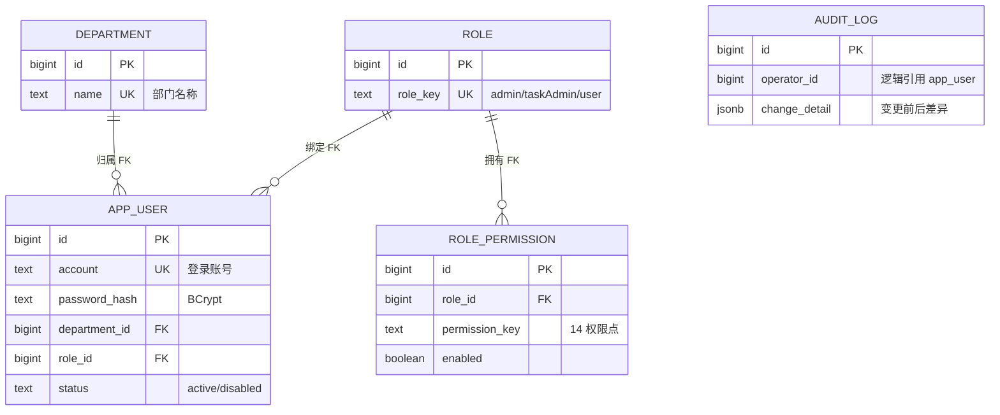
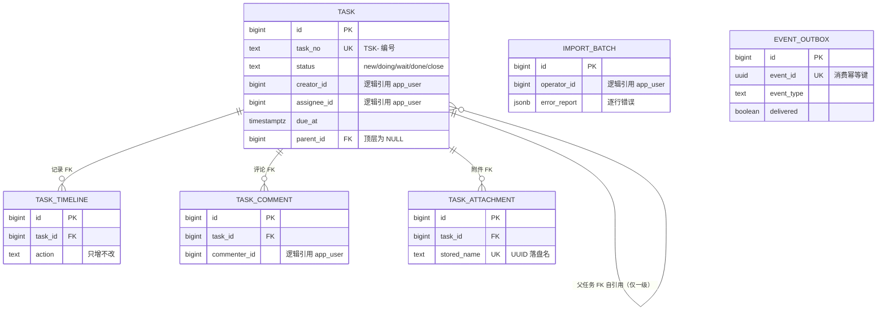
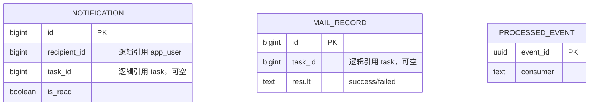
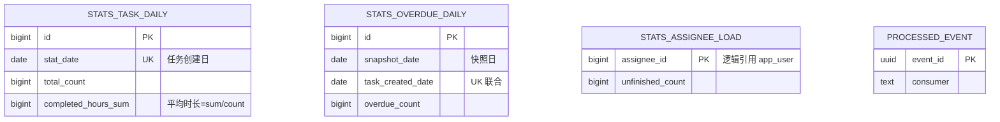

# TaskFlow 任务管理系统 库表设计文档

> 版本：v1.0 · 状态：待评审
> 关联 PRD：[`docs/PRD-任务管理系统-v1.0.md`](PRD-任务管理系统-v1.0.md)（第 5 章为本文档的需求来源）
> 关联架构：[`docs/架构设计文档-v1.0.md`](架构设计文档-v1.0.md)（分库方案、event_outbox、stats 预聚合的来源）
> 设计规范：postgresql-table-design 技能

---

## 1. 文档信息

### 1.1 设计决策基线

以下决策已在设计评审中确认：

| # | 决策点 | 结论 |
|---|---|---|
| 1 | 主键 | 全部 `BIGINT GENERATED ALWAYS AS IDENTITY`；业务编号单独列 |
| 2 | 任务编号 | `task_no TEXT UNIQUE`，由 PG 序列发号 + 应用层拼 `TSK-` 前缀；**接受跳号**（不违反 PRD"唯一、单调递增、不复用"） |
| 3 | 跨库引用 | PG 无法跨库建 FK，跨服务引用列均为纯 BIGINT 逻辑引用，一致性由应用层保证；库内引用正常建 FK |
| 4 | 枚举 | 一律 `TEXT + CHECK`，不用 PG 原生 ENUM 类型（业务值会演化） |
| 5 | 时间 | 一律 `TIMESTAMPTZ`（UTC 存储，东八区渲染，PRD 7.4） |
| 6 | 架构新增表 | event_outbox（task_db）、processed_event（notification_db / stats_db）、stats 三张聚合表；登录失败计数放 Redis 不落库 |
| 7 | 逾期 KPI | 每日 `task.overdue` 扫描事件驱动日快照，**接受 ≤ 24 小时误差** |

### 1.2 命名与通用约定

1. 全部标识符 `snake_case` 小写，不使用引号包裹的混合大小写名称。
2. ⚠️ 用户表命名 `app_user`：`user` 是 PG 保留字，避免全程加双引号的事故源。
3. 每张表含 `created_at TIMESTAMPTZ NOT NULL DEFAULT now()`；含 `updated_at` 的表由应用层（MyBatis 自动填充）维护。
4. 环境要求：PostgreSQL 15+；task_db 需启用 `pg_trgm` 扩展（关键字模糊搜索）。
5. **每张表与每个字段必须带 `COMMENT ON` 注释**（说明业务含义与 PRD 出处），注释随 DDL 进数据库元数据，`\d+` 与数据字典工具可直接读取；后续加表加字段同样遵守。
6. 分库归属遵循架构文档 3.1：`auth_user_db` / `task_db` / `notification_db` / `stats_db`，每库由对应服务独占访问。

---

## 2. 实体关系总览（ER 图）

按库分四组绘制全部 18 张表；**实线为库内 FK（数据库强制）**，跨库逻辑引用（无数据库约束，应用层保证）见 2.5 列表。属性仅列关键列，完整字段见第 3-6 章 DDL。

### 2.1 auth_user_db



### 2.2 task_db



### 2.3 notification_db



### 2.4 stats_db



> 注：notification_db 与 stats_db 的表间无库内 FK（引用全部指向外部库），故图中无连线，各表为独立实体。

### 2.5 跨库逻辑引用清单（无数据库约束，应用层保证）

| 引用列 | 指向 | 保障机制 |
|---|---|---|
| task.creator_id / task.assignee_id | auth_user_db.app_user.id | 写入时 Feign 校验；用户停用不删除（PRD 4.5.1） |
| task_timeline.operator_id | app_user.id | 取自登录身份 |
| task_comment.commenter_id | app_user.id | 取自登录身份 |
| task_attachment.uploader_id | app_user.id | 取自登录身份 |
| import_batch.operator_id | app_user.id | 取自登录身份 |
| audit_log.operator_id | app_user.id | 取自登录身份 |
| notification.recipient_id | app_user.id | 事件载荷携带 |
| notification.task_id | task_db.task.id | 事件载荷携带；点击跳转前校验可见性 |
| mail_record.task_id | task_db.task.id | 事件载荷携带 |
| stats_assignee_load.assignee_id | app_user.id | 事件载荷携带 |

---

## 3. auth_user_db

```sql
-- ============================================================
-- auth_user_db：auth-user-service 独占
-- ============================================================

CREATE TABLE department (
    id          BIGINT GENERATED ALWAYS AS IDENTITY PRIMARY KEY,
    name        TEXT NOT NULL UNIQUE CHECK (LENGTH(name) BETWEEN 1 AND 50),
    created_at  TIMESTAMPTZ NOT NULL DEFAULT now()
);
COMMENT ON TABLE  department IS '部门（单层列表，PRD 4.5.2；存在在职用户的部门不可删除）';
COMMENT ON COLUMN department.name IS '部门名称，全局唯一，≤ 50 字符';
COMMENT ON COLUMN department.created_at IS '创建时间（UTC）';

CREATE TABLE role (
    id          BIGINT GENERATED ALWAYS AS IDENTITY PRIMARY KEY,
    role_key    TEXT NOT NULL UNIQUE CHECK (role_key IN ('admin', 'taskAdmin', 'user')),
    name        TEXT NOT NULL,
    created_at  TIMESTAMPTZ NOT NULL DEFAULT now()
);
COMMENT ON TABLE  role IS '预置角色（固定 3 条，PRD 3.1；一期不支持自定义角色）';
COMMENT ON COLUMN role.role_key IS '角色键：admin 系统管理员 / taskAdmin 任务管理员 / user 普通用户';
COMMENT ON COLUMN role.name IS '角色显示名';
COMMENT ON COLUMN role.created_at IS '创建时间（UTC）';

CREATE TABLE app_user (
    id                   BIGINT GENERATED ALWAYS AS IDENTITY PRIMARY KEY,
    account              TEXT NOT NULL UNIQUE
                         CHECK (account ~ '^[a-zA-Z0-9_]{4,32}$'),
    name                 TEXT NOT NULL,
    password_hash        TEXT NOT NULL,                    -- BCrypt
    email                TEXT NOT NULL
                         CHECK (email ~* '^[A-Za-z0-9._%+-]+@[A-Za-z0-9.-]+\.[A-Za-z]{2,}$'),
    department_id        BIGINT NOT NULL REFERENCES department(id),
    role_id              BIGINT NOT NULL REFERENCES role(id),
    status               TEXT NOT NULL DEFAULT 'active'
                         CHECK (status IN ('active', 'disabled')),
    must_change_password BOOLEAN NOT NULL DEFAULT TRUE,    -- 首次登录 / 重置后强制改密
    created_at           TIMESTAMPTZ NOT NULL DEFAULT now()
);
COMMENT ON TABLE  app_user IS '用户（PRD 4.5.1；不可物理删除，停用走 status）';
COMMENT ON COLUMN app_user.account IS '登录账号，唯一，字母数字下划线 4-32 位';
COMMENT ON COLUMN app_user.name IS '姓名';
COMMENT ON COLUMN app_user.password_hash IS '密码哈希（BCrypt，PRD 7.3.1）';
COMMENT ON COLUMN app_user.email IS '邮箱（通知邮件接收地址）';
COMMENT ON COLUMN app_user.department_id IS '归属部门';
COMMENT ON COLUMN app_user.role_id IS '绑定角色（每用户仅一个，PRD 4.5.3）';
COMMENT ON COLUMN app_user.status IS '在职状态：active 在职 / disabled 停用（禁止登录，名下未完成任务保留）';
COMMENT ON COLUMN app_user.must_change_password IS '下次登录强制改密（新增用户与重置密码后为 TRUE）';
COMMENT ON COLUMN app_user.created_at IS '创建时间（UTC）';
CREATE INDEX idx_app_user_department ON app_user (department_id);
CREATE INDEX idx_app_user_role ON app_user (role_id);
-- 用户不可物理删除（PRD 4.5.1），停用走 status = 'disabled'

CREATE TABLE role_permission (
    id              BIGINT GENERATED ALWAYS AS IDENTITY PRIMARY KEY,
    role_id         BIGINT NOT NULL REFERENCES role(id),
    permission_key  TEXT NOT NULL CHECK (permission_key IN (
                        'viewAll', 'create', 'editOwn', 'deleteOwn', 'transferOwn',
                        'prioOwn', 'dueOwn', 'viewAssigned', 'updateAssigned',
                        'transferAssigned', 'viewStats', 'exportData',
                        'manageUser', 'setPerm')),
    enabled         BOOLEAN NOT NULL DEFAULT FALSE,
    created_at      TIMESTAMPTZ NOT NULL DEFAULT now(),
    UNIQUE (role_id, permission_key)
);
COMMENT ON TABLE  role_permission IS '角色权限矩阵（3 角色 × 14 权限点，PRD 3.2/4.5.4；勾选即改即存）';
COMMENT ON COLUMN role_permission.role_id IS '角色';
COMMENT ON COLUMN role_permission.permission_key IS '权限点键（14 个之一，PRD 3.2）';
COMMENT ON COLUMN role_permission.enabled IS '开关：TRUE 授予 / FALSE 收回（admin 的 manageUser、setPerm 恒为 TRUE）';
COMMENT ON COLUMN role_permission.created_at IS '创建时间（UTC）';

CREATE TABLE audit_log (
    id              BIGINT GENERATED ALWAYS AS IDENTITY PRIMARY KEY,
    operator_id     BIGINT NOT NULL,            -- 逻辑引用 app_user.id（跨服务写入场景不建 FK）
    action          TEXT NOT NULL,              -- 如 'permission.matrix.update'
    change_detail   JSONB NOT NULL,             -- 变更前后差异，如 {"viewAll": {"taskAdmin": [false, true]}}
    created_at      TIMESTAMPTZ NOT NULL DEFAULT now()
);
COMMENT ON TABLE  audit_log IS '审计日志（只增不改，PRD 4.5.4；在线 1 年后转冷存储，PRD 7.5）';
COMMENT ON COLUMN audit_log.operator_id IS '操作人（逻辑引用 app_user.id）';
COMMENT ON COLUMN audit_log.action IS '操作类型，如 permission.matrix.update';
COMMENT ON COLUMN audit_log.change_detail IS '变更前后差异，如 {"viewAll": {"taskAdmin": [false, true]}}';
COMMENT ON COLUMN audit_log.created_at IS '操作时间（UTC）';
CREATE INDEX idx_audit_log_operator ON audit_log (operator_id);
CREATE INDEX idx_audit_log_created ON audit_log (created_at DESC);
-- 只增不改：应用账号回收 UPDATE/DELETE 权限（见 7.2）
```

---

## 4. task_db

```sql
-- ============================================================
-- task_db：task-service 独占
-- ============================================================
CREATE EXTENSION IF NOT EXISTS pg_trgm;   -- 关键字模糊搜索（PRD 4.2.1）

-- 任务编号序列：从 100001 起，接受跳号（决策基线 #2）
CREATE SEQUENCE task_no_seq START 100001 INCREMENT 1;
COMMENT ON SEQUENCE task_no_seq IS '任务编号序列（100001 起，应用层拼 TSK- 前缀；允许跳号，见决策基线 #2）';

CREATE TABLE task (
    id            BIGINT GENERATED ALWAYS AS IDENTITY PRIMARY KEY,
    task_no       TEXT NOT NULL UNIQUE,                   -- 'TSK-' || nextval('task_no_seq')，应用层拼接
    title         TEXT NOT NULL CHECK (LENGTH(title) BETWEEN 1 AND 100),
    description   TEXT CHECK (LENGTH(description) <= 2000),
    task_type     TEXT NOT NULL DEFAULT '项目开发' CHECK (task_type IN (
                      '项目开发', '日常事务', '会议事项', '调研分析', '数据报表', '流程审批')),
    priority      TEXT NOT NULL DEFAULT 'P2' CHECK (priority IN ('P0', 'P1', 'P2', 'P3')),
    status        TEXT NOT NULL DEFAULT 'new'
                  CHECK (status IN ('new', 'doing', 'wait', 'done', 'close')),
    creator_id    BIGINT NOT NULL,                        -- 逻辑引用 auth_user_db.app_user
    assignee_id   BIGINT NOT NULL,                        -- 逻辑引用，角色为 taskAdmin/user 的在职用户
    due_at        TIMESTAMPTZ NOT NULL,
    progress      INT NOT NULL DEFAULT 0
                  CHECK (progress BETWEEN 0 AND 100 AND progress % 5 = 0),
    source        TEXT NOT NULL DEFAULT '网页'
                  CHECK (source IN ('网页', 'Excel 导入', 'OpenAPI')),
    parent_id     BIGINT REFERENCES task(id),             -- 顶层任务为 NULL；仅一级嵌套由触发器保证
    due_reminded  BOOLEAN NOT NULL DEFAULT FALSE,         -- 到期前 24h 提醒已发标记（每任务仅一次）
    created_at    TIMESTAMPTZ NOT NULL DEFAULT now(),
    updated_at    TIMESTAMPTZ NOT NULL DEFAULT now()
);
COMMENT ON TABLE  task IS '任务主表（PRD 4.1.1；子任务同表，parent_id 指向顶层任务，仅一级嵌套）';
COMMENT ON COLUMN task.task_no IS '任务编号，TSK- + task_no_seq，全局唯一不复用（PRD 5.3.1）';
COMMENT ON COLUMN task.title IS '标题，1-100 字符';
COMMENT ON COLUMN task.description IS '描述（背景、目标与验收标准），≤ 2000 字符';
COMMENT ON COLUMN task.task_type IS '任务类型（6 枚举之一，子任务继承父任务）';
COMMENT ON COLUMN task.priority IS '优先级：P0 紧急 / P1 高 / P2 中 / P3 低';
COMMENT ON COLUMN task.status IS '状态机：new 待办 / doing 进行中 / wait 待验收 / done 已完成 / close 已归档（PRD 4.1.2；子任务仅用 new/doing/done）';
COMMENT ON COLUMN task.creator_id IS '创建人（逻辑引用 auth_user_db.app_user.id）';
COMMENT ON COLUMN task.assignee_id IS '处理人（逻辑引用；角色为 taskAdmin/user 的在职用户，admin 不可担任）';
COMMENT ON COLUMN task.due_at IS '到期时间（精确到分钟，PRD 4.1.1）';
COMMENT ON COLUMN task.progress IS '进度 0-100，步进 5';
COMMENT ON COLUMN task.source IS '来源渠道：网页 / Excel 导入 / OpenAPI（子任务固定"网页"；企微同步等为预留值）';
COMMENT ON COLUMN task.parent_id IS '父任务（顶层任务为 NULL；一级嵌套由触发器 trg_task_parent_top_level 保证）';
COMMENT ON COLUMN task.due_reminded IS '到期前 24h 提醒已发标记（每任务仅一次，PRD 4.6.1 事件 6）';
COMMENT ON COLUMN task.created_at IS '创建时间（UTC；统计区间口径以此为准，PRD 4.3.1）';
COMMENT ON COLUMN task.updated_at IS '更新时间（每次状态或字段变更刷新；完成时长与按时率以此计）';
-- 可见性过滤（PRD 3.4 规则 3、4，OR 关系）
CREATE INDEX idx_task_creator ON task (creator_id);
CREATE INDEX idx_task_assignee ON task (assignee_id);
CREATE INDEX idx_task_parent ON task (parent_id);
-- 默认排序：创建时间倒序
CREATE INDEX idx_task_created ON task (created_at DESC);
-- 定时扫描专用部分索引：只覆盖未完成子集，不随归档数据膨胀
CREATE INDEX idx_task_due_unfinished ON task (due_at)
    WHERE status IN ('new', 'doing', 'wait');
-- 关键字搜索（标题 / 描述）；编号为前缀精确匹配走 task_no UNIQUE 索引
CREATE INDEX idx_task_title_trgm ON task USING GIN (title gin_trgm_ops);
CREATE INDEX idx_task_desc_trgm ON task USING GIN (description gin_trgm_ops);

-- 子任务仅一级嵌套：跨行约束用触发器双保险（应用层校验之外）
CREATE OR REPLACE FUNCTION check_parent_is_top_level() RETURNS trigger AS $$
BEGIN
    IF NEW.parent_id IS NOT NULL THEN
        IF NEW.parent_id = NEW.id THEN
            RAISE EXCEPTION '任务不能以自身为父任务';
        END IF;
        IF EXISTS (SELECT 1 FROM task WHERE id = NEW.parent_id AND parent_id IS NOT NULL) THEN
            RAISE EXCEPTION '子任务仅允许一级嵌套（父任务必须是顶层任务）';
        END IF;
    END IF;
    RETURN NEW;
END;
$$ LANGUAGE plpgsql;

CREATE TRIGGER trg_task_parent_top_level
    BEFORE INSERT OR UPDATE ON task
    FOR EACH ROW EXECUTE FUNCTION check_parent_is_top_level();

CREATE TABLE task_timeline (
    id           BIGINT GENERATED ALWAYS AS IDENTITY PRIMARY KEY,
    task_id      BIGINT NOT NULL REFERENCES task(id),
    operator_id  BIGINT NOT NULL,               -- 逻辑引用 app_user
    action       TEXT NOT NULL,                 -- 创建/受理/更新进度/转派/调整优先级/调整到期/提交验收/验收通过/验收驳回/手动归档/自动归档
    note         TEXT,                          -- 进展说明 / 驳回原因(≤500) / 转派说明(≤200) 等
    created_at   TIMESTAMPTZ NOT NULL DEFAULT now()
);
COMMENT ON TABLE  task_timeline IS '操作时间线（只增不改，PRD 4.1.4；按时间倒序展示）';
COMMENT ON COLUMN task_timeline.task_id IS '所属任务';
COMMENT ON COLUMN task_timeline.operator_id IS '操作人（逻辑引用 app_user.id；自动归档记系统操作）';
COMMENT ON COLUMN task_timeline.action IS '动作：创建/受理/更新进度/转派/调整优先级/调整到期/提交验收/验收通过/验收驳回/手动归档/自动归档';
COMMENT ON COLUMN task_timeline.note IS '备注：进展说明 / 驳回原因(≤500) / 转派说明(≤200) 等';
COMMENT ON COLUMN task_timeline.created_at IS '操作时间（UTC）';
CREATE INDEX idx_timeline_task ON task_timeline (task_id, created_at DESC);
-- 只增不改（PRD 4.1.4）：应用账号回收 UPDATE/DELETE 权限（见 7.2）

CREATE TABLE task_comment (
    id            BIGINT GENERATED ALWAYS AS IDENTITY PRIMARY KEY,
    task_id       BIGINT NOT NULL REFERENCES task(id),
    commenter_id  BIGINT NOT NULL,              -- 逻辑引用 app_user
    content       TEXT NOT NULL CHECK (LENGTH(content) BETWEEN 1 AND 500),
    created_at    TIMESTAMPTZ NOT NULL DEFAULT now()
);
COMMENT ON TABLE  task_comment IS '任务评论（PRD 4.1.5；可删不可改，不写入操作时间线）';
COMMENT ON COLUMN task_comment.task_id IS '所属任务（子任务同表支持）';
COMMENT ON COLUMN task_comment.commenter_id IS '评论人（逻辑引用 app_user.id）';
COMMENT ON COLUMN task_comment.content IS '评论内容，纯文本 ≤ 500 字符';
COMMENT ON COLUMN task_comment.created_at IS '评论时间（UTC；按时间正序展示）';
CREATE INDEX idx_comment_task ON task_comment (task_id, created_at);

CREATE TABLE task_attachment (
    id             BIGINT GENERATED ALWAYS AS IDENTITY PRIMARY KEY,
    task_id        BIGINT NOT NULL REFERENCES task(id),
    original_name  TEXT NOT NULL,               -- 下载按此名返回
    stored_name    TEXT NOT NULL UNIQUE,        -- UUID 落盘文件名，防路径穿越
    size_bytes     BIGINT NOT NULL CHECK (size_bytes > 0 AND size_bytes <= 20971520),  -- 20MB
    uploader_id    BIGINT NOT NULL,             -- 逻辑引用 app_user
    created_at     TIMESTAMPTZ NOT NULL DEFAULT now()
);
COMMENT ON TABLE  task_attachment IS '任务附件元数据（PRD 4.1.6；文件本体存服务端本地文件系统，见架构文档 2.4）';
COMMENT ON COLUMN task_attachment.task_id IS '所属任务（附件归属所在任务，独立计数 ≤ 10 个）';
COMMENT ON COLUMN task_attachment.original_name IS '原始文件名（下载按此名返回）';
COMMENT ON COLUMN task_attachment.stored_name IS '落盘文件名（UUID，防路径穿越）';
COMMENT ON COLUMN task_attachment.size_bytes IS '文件大小（字节，单文件 ≤ 20MB）';
COMMENT ON COLUMN task_attachment.uploader_id IS '上传人（逻辑引用 app_user.id；删除限本人或 admin）';
COMMENT ON COLUMN task_attachment.created_at IS '上传时间（UTC）';
CREATE INDEX idx_attachment_task ON task_attachment (task_id);
-- 每任务 ≤ 10 个附件由应用层校验（行数约束不适合 CHECK）

CREATE TABLE import_batch (
    id             BIGINT GENERATED ALWAYS AS IDENTITY PRIMARY KEY,
    operator_id    BIGINT NOT NULL,             -- 逻辑引用 app_user
    file_name      TEXT NOT NULL,
    total_rows     INT NOT NULL CHECK (total_rows BETWEEN 0 AND 500),
    success_count  INT NOT NULL DEFAULT 0,
    fail_count     INT NOT NULL DEFAULT 0,
    error_report   JSONB,                       -- 逐行错误：[{"row": 3, "reason": "处理人账号不存在"}]
    created_at     TIMESTAMPTZ NOT NULL DEFAULT now()
);
COMMENT ON TABLE  import_batch IS 'Excel 导入批次记录（PRD 4.7；保留 1 年）';
COMMENT ON COLUMN import_batch.operator_id IS '导入操作人（逻辑引用 app_user.id；导入任务的创建人）';
COMMENT ON COLUMN import_batch.file_name IS '导入文件名';
COMMENT ON COLUMN import_batch.total_rows IS '文件总行数（单次上限 500）';
COMMENT ON COLUMN import_batch.success_count IS '成功行数（整批校验，任一行失败则全批不入库）';
COMMENT ON COLUMN import_batch.fail_count IS '失败行数';
COMMENT ON COLUMN import_batch.error_report IS '逐行错误报告：[{"row": 3, "reason": "处理人账号不存在"}]';
COMMENT ON COLUMN import_batch.created_at IS '导入时间（UTC）';
CREATE INDEX idx_import_batch_created ON import_batch (created_at DESC);

-- 本地消息表（架构文档 4.2 / 第 5 章）：事件与业务同事务，后台线程轮询投递
CREATE TABLE event_outbox (
    id            BIGINT GENERATED ALWAYS AS IDENTITY PRIMARY KEY,
    event_id      UUID NOT NULL UNIQUE DEFAULT gen_random_uuid(),   -- 消费端幂等键
    event_type    TEXT NOT NULL,                -- task.assigned / task.status.changed / ...
    payload       JSONB NOT NULL,
    delivered     BOOLEAN NOT NULL DEFAULT FALSE,
    created_at    TIMESTAMPTZ NOT NULL DEFAULT now(),
    delivered_at  TIMESTAMPTZ
);
COMMENT ON TABLE  event_outbox IS '本地消息表（架构文档 4.2/第 5 章；事件与业务同事务，后台线程轮询投递 RabbitMQ）';
COMMENT ON COLUMN event_outbox.event_id IS '事件全局唯一 ID（消费端幂等去重键）';
COMMENT ON COLUMN event_outbox.event_type IS '事件类型：task.assigned / task.status.changed / task.due.soon / task.overdue 等（架构文档 3.3）';
COMMENT ON COLUMN event_outbox.payload IS '事件载荷（变更前后状态与关键字段；schema 在 common 模块，字段只增不改）';
COMMENT ON COLUMN event_outbox.delivered IS '投递标记：FALSE 待投递 / TRUE 已投递（失败重投）';
COMMENT ON COLUMN event_outbox.created_at IS '事件产生时间（UTC）';
COMMENT ON COLUMN event_outbox.delivered_at IS '投递成功时间（UTC）';
-- 投递线程只扫未投递子集
CREATE INDEX idx_outbox_undelivered ON event_outbox (created_at) WHERE NOT delivered;
```

---

## 5. notification_db

```sql
-- ============================================================
-- notification_db：notification-service 独占
-- ============================================================

CREATE TABLE notification (
    id            BIGINT GENERATED ALWAYS AS IDENTITY PRIMARY KEY,
    recipient_id  BIGINT NOT NULL,              -- 逻辑引用 app_user
    event_type    TEXT NOT NULL,                -- PRD 4.6.1 的 8 类事件
    summary       TEXT NOT NULL,                -- 消息摘要
    task_id       BIGINT,                       -- 逻辑引用 task_db.task，点击跳转用
    is_read       BOOLEAN NOT NULL DEFAULT FALSE,
    created_at    TIMESTAMPTZ NOT NULL DEFAULT now()
);
COMMENT ON TABLE  notification IS '站内消息（PRD 4.6.2；保留 180 天，过期定时清理）';
COMMENT ON COLUMN notification.recipient_id IS '接收人（逻辑引用 app_user.id）';
COMMENT ON COLUMN notification.event_type IS '触发事件（PRD 4.6.1 的 8 类之一）';
COMMENT ON COLUMN notification.summary IS '消息摘要';
COMMENT ON COLUMN notification.task_id IS '关联任务（逻辑引用 task_db.task.id；点击跳转详情用，可空）';
COMMENT ON COLUMN notification.is_read IS '已读标记（未读数角标按此统计）';
COMMENT ON COLUMN notification.created_at IS '消息时间（UTC；列表倒序）';
-- 未读数角标（60 秒轮询，PRD 6.1）
CREATE INDEX idx_notification_unread ON notification (recipient_id) WHERE NOT is_read;
-- 消息列表倒序
CREATE INDEX idx_notification_list ON notification (recipient_id, created_at DESC);
-- 180 天过期清理按 created_at（本服务自有数据的清理由 notification-service 自行定时执行；
-- "定时任务归 task-service"的决策仅针对任务数据的跨服务扫描，见架构文档 3.1 / 4.3）
CREATE INDEX idx_notification_created ON notification (created_at);

CREATE TABLE mail_record (
    id           BIGINT GENERATED ALWAYS AS IDENTITY PRIMARY KEY,
    task_id      BIGINT,                        -- 逻辑引用 task；SMTP 故障告警 admin 的邮件不关联任务，可空
    recipient    TEXT NOT NULL,
    subject      TEXT NOT NULL,                 -- 【任务管理】<事件> <任务编号> <任务标题>
    result       TEXT NOT NULL CHECK (result IN ('success', 'failed')),
    retry_count  INT NOT NULL DEFAULT 0,        -- 指数退避重试 ≤ 3 次
    created_at   TIMESTAMPTZ NOT NULL DEFAULT now()
);
COMMENT ON TABLE  mail_record IS '邮件记录（PRD 4.6.3；保留 1 年）';
COMMENT ON COLUMN mail_record.task_id IS '关联任务（逻辑引用；SMTP 故障告警 admin 的邮件不关联任务，可空）';
COMMENT ON COLUMN mail_record.recipient IS '收件人邮箱';
COMMENT ON COLUMN mail_record.subject IS '主题：【任务管理】<事件> <任务编号> <任务标题>';
COMMENT ON COLUMN mail_record.result IS '发送结果：success / failed（重试 3 次仍失败记 failed 并告警）';
COMMENT ON COLUMN mail_record.retry_count IS '已重试次数（指数退避，≤ 3）';
COMMENT ON COLUMN mail_record.created_at IS '发送时间（UTC）';
CREATE INDEX idx_mail_record_task ON mail_record (task_id);      -- 任务详情关联记录
CREATE INDEX idx_mail_record_created ON mail_record (created_at);

-- 消费幂等去重：INSERT 冲突即跳过
CREATE TABLE processed_event (
    event_id      UUID PRIMARY KEY,
    consumer      TEXT NOT NULL,                -- 消费者标识，如 'notification.mail'
    processed_at  TIMESTAMPTZ NOT NULL DEFAULT now()
);
COMMENT ON TABLE  processed_event IS '消费幂等去重表（INSERT 冲突即跳过；架构文档第 5 章）';
COMMENT ON COLUMN processed_event.event_id IS '已消费的事件 ID';
COMMENT ON COLUMN processed_event.consumer IS '消费者标识，如 notification.mail';
COMMENT ON COLUMN processed_event.processed_at IS '消费时间（UTC）';
```

---

## 6. stats_db

```sql
-- ============================================================
-- stats_db：stats-service 独占（事件驱动增量聚合，架构文档 4.4）
-- ============================================================

-- 按任务创建日的日粒度聚合：KPI 查询 = 按区间 SUM
CREATE TABLE stats_task_daily (
    id                    BIGINT GENERATED ALWAYS AS IDENTITY PRIMARY KEY,
    stat_date             DATE NOT NULL UNIQUE,           -- 任务创建日（PRD 4.3.1 区间口径）
    total_count           BIGINT NOT NULL DEFAULT 0,
    new_count             BIGINT NOT NULL DEFAULT 0,
    doing_count           BIGINT NOT NULL DEFAULT 0,
    wait_count            BIGINT NOT NULL DEFAULT 0,
    done_count            BIGINT NOT NULL DEFAULT 0,
    close_count           BIGINT NOT NULL DEFAULT 0,
    p0_count              BIGINT NOT NULL DEFAULT 0,
    p1_count              BIGINT NOT NULL DEFAULT 0,
    p2_count              BIGINT NOT NULL DEFAULT 0,
    p3_count              BIGINT NOT NULL DEFAULT 0,
    completed_count       BIGINT NOT NULL DEFAULT 0,      -- 已完成 + 已归档
    completed_hours_sum   NUMERIC(12,1) NOT NULL DEFAULT 0,  -- 平均完成时长 = sum / count
    ontime_count          BIGINT NOT NULL DEFAULT 0       -- 按时完成率 = ontime / completed
);
COMMENT ON TABLE  stats_task_daily IS '按任务创建日的日粒度聚合（KPI 与图表数据源；只计顶层任务；事件驱动增量 ±1，架构文档 4.4）';
COMMENT ON COLUMN stats_task_daily.stat_date IS '统计日 = 任务创建日（PRD 4.3.1 区间过滤口径）';
COMMENT ON COLUMN stats_task_daily.total_count IS '当日创建任务总数';
COMMENT ON COLUMN stats_task_daily.new_count IS '当日创建任务中当前为待办的数量';
COMMENT ON COLUMN stats_task_daily.doing_count IS '当日创建任务中当前为进行中的数量';
COMMENT ON COLUMN stats_task_daily.wait_count IS '当日创建任务中当前为待验收的数量';
COMMENT ON COLUMN stats_task_daily.done_count IS '当日创建任务中当前为已完成的数量';
COMMENT ON COLUMN stats_task_daily.close_count IS '当日创建任务中当前为已归档的数量';
COMMENT ON COLUMN stats_task_daily.p0_count IS '当日创建的 P0 任务数（P1-P3 同理）';
COMMENT ON COLUMN stats_task_daily.completed_count IS '当日创建且已完成/已归档的任务数';
COMMENT ON COLUMN stats_task_daily.completed_hours_sum IS '已完成任务的完成时长合计（小时）；平均完成时长 = completed_hours_sum / completed_count';
COMMENT ON COLUMN stats_task_daily.ontime_count IS '按时完成数（更新时间 ≤ 到期时间）；按时完成率 = ontime_count / completed_count';
-- 只计顶层任务（PRD 4.3.2）：事件载荷含 parent_id，消费端丢弃子任务事件

-- 逾期日快照（决策基线 #7）：由每日 task.overdue 扫描事件累积
CREATE TABLE stats_overdue_daily (
    id                 BIGINT GENERATED ALWAYS AS IDENTITY PRIMARY KEY,
    snapshot_date      DATE NOT NULL,                     -- 快照日（每日 09:00 扫描产生）
    task_created_date  DATE NOT NULL,                     -- 任务创建日，支撑区间过滤
    overdue_count      BIGINT NOT NULL DEFAULT 0,
    UNIQUE (snapshot_date, task_created_date)
);
COMMENT ON TABLE  stats_overdue_daily IS '逾期任务日快照（决策基线 #7；由每日 task.overdue 扫描事件累积，误差 ≤ 24 小时）';
COMMENT ON COLUMN stats_overdue_daily.snapshot_date IS '快照日（每日 09:00 扫描产生）';
COMMENT ON COLUMN stats_overdue_daily.task_created_date IS '逾期任务的创建日（支撑 KPI 区间过滤）';
COMMENT ON COLUMN stats_overdue_daily.overdue_count IS '该快照日、该创建日的逾期任务数';
CREATE INDEX idx_overdue_snapshot ON stats_overdue_daily (snapshot_date);
-- 查询：取 MAX(snapshot_date) 的行，按 task_created_date 区间 SUM

-- 人员负载图（PRD 4.3.3）：当前值表，事件驱动 ±1
CREATE TABLE stats_assignee_load (
    assignee_id       BIGINT PRIMARY KEY,         -- 逻辑引用 app_user
    unfinished_count  BIGINT NOT NULL DEFAULT 0,  -- 待办 + 进行中 + 待验收
    updated_at        TIMESTAMPTZ NOT NULL DEFAULT now()
);
COMMENT ON TABLE  stats_assignee_load IS '人员负载当前值表（PRD 4.3.3 人员负载图；事件驱动 ±1）';
COMMENT ON COLUMN stats_assignee_load.assignee_id IS '处理人（逻辑引用 app_user.id；查询时排除 admin 角色）';
COMMENT ON COLUMN stats_assignee_load.unfinished_count IS '名下未完成（待办+进行中+待验收）任务数';
COMMENT ON COLUMN stats_assignee_load.updated_at IS '最后更新时间（UTC）';
-- 查询时排除 admin 角色用户（应用层过滤）

CREATE TABLE processed_event (
    event_id      UUID PRIMARY KEY,
    consumer      TEXT NOT NULL,
    processed_at  TIMESTAMPTZ NOT NULL DEFAULT now()
);
COMMENT ON TABLE  processed_event IS '消费幂等去重表（INSERT 冲突即跳过；架构文档第 5 章）';
COMMENT ON COLUMN processed_event.event_id IS '已消费的事件 ID';
COMMENT ON COLUMN processed_event.consumer IS '消费者标识，如 stats.daily';
COMMENT ON COLUMN processed_event.processed_at IS '消费时间（UTC）';
```

---

## 7. 种子数据与数据一致性保障

### 7.1 种子数据（初始化 SQL 随 deploy/ 目录交付）

```sql
-- 角色（3 条，PRD 3.1）
INSERT INTO role (role_key, name) VALUES
    ('admin', '系统管理员'),
    ('taskAdmin', '任务管理员'),
    ('user', '普通用户');

-- 权限矩阵（42 条 = 3 角色 × 14 权限点，按 PRD 3.3 默认矩阵）
-- admin：14 项全 true
INSERT INTO role_permission (role_id, permission_key, enabled)
SELECT r.id, p.key, TRUE
FROM role r CROSS JOIN (VALUES
    ('viewAll'), ('create'), ('editOwn'), ('deleteOwn'), ('transferOwn'),
    ('prioOwn'), ('dueOwn'), ('viewAssigned'), ('updateAssigned'),
    ('transferAssigned'), ('viewStats'), ('exportData'), ('manageUser'), ('setPerm')
) AS p(key)
WHERE r.role_key = 'admin';

-- taskAdmin：除 viewAll / manageUser / setPerm 外全 true
INSERT INTO role_permission (role_id, permission_key, enabled)
SELECT r.id, p.key, p.key NOT IN ('viewAll', 'manageUser', 'setPerm')
FROM role r CROSS JOIN (VALUES
    ('viewAll'), ('create'), ('editOwn'), ('deleteOwn'), ('transferOwn'),
    ('prioOwn'), ('dueOwn'), ('viewAssigned'), ('updateAssigned'),
    ('transferAssigned'), ('viewStats'), ('exportData'), ('manageUser'), ('setPerm')
) AS p(key)
WHERE r.role_key = 'taskAdmin';

-- user：仅 viewAssigned / updateAssigned / transferAssigned 为 true
INSERT INTO role_permission (role_id, permission_key, enabled)
SELECT r.id, p.key, p.key IN ('viewAssigned', 'updateAssigned', 'transferAssigned')
FROM role r CROSS JOIN (VALUES
    ('viewAll'), ('create'), ('editOwn'), ('deleteOwn'), ('transferOwn'),
    ('prioOwn'), ('dueOwn'), ('viewAssigned'), ('updateAssigned'),
    ('transferAssigned'), ('viewStats'), ('exportData'), ('manageUser'), ('setPerm')
) AS p(key)
WHERE r.role_key = 'user';
```

另需：默认部门 1 条 + 初始 admin 用户 1 条（初始密码由部署脚本生成随机值并 BCrypt 加密写入，`must_change_password = TRUE`，不落入代码库）。

### 7.2 只增表的硬约束

`task_timeline`、`audit_log` 要求只增不改（PRD 4.1.4 / 7.5）。除应用层不提供更新入口外，数据库层回收应用账号的修改权限：

```sql
-- 以服务应用账号 app_task / app_auth 为例（账号由部署脚本创建）
REVOKE UPDATE, DELETE ON task_timeline FROM app_task;
REVOKE UPDATE, DELETE ON audit_log FROM app_auth;
-- 超保留期清理由独立的运维账号执行，与应用账号分离
```

---

## 8. 索引与查询路径对照

| 查询路径（PRD 出处） | 命中索引 |
|---|---|
| 可见性过滤"我创建的 / 指派给我的"（3.4） | `idx_task_creator` / `idx_task_assignee` |
| 列表默认排序：创建时间倒序（4.2.2） | `idx_task_created` |
| 到期 / 逾期定时扫描（4.6.1 事件 6、7） | `idx_task_due_unfinished`（部分索引） |
| 关键字搜索标题 / 描述（4.2.1） | `idx_task_title_trgm` / `idx_task_desc_trgm`（pg_trgm GIN） |
| 任务详情：时间线 / 评论 / 附件（4.1.3） | `idx_timeline_task` / `idx_comment_task` / `idx_attachment_task` |
| 子任务清单（4.1.7） | `idx_task_parent` |
| 未读数角标 60 秒轮询（6.1） | `idx_notification_unread`（部分索引） |
| 消息列表倒序（4.6.2） | `idx_notification_list` |
| 审计日志页：倒序 + 按操作人筛选（4.5.4） | `idx_audit_log_created` / `idx_audit_log_operator` |
| outbox 投递线程轮询（架构 4.2） | `idx_outbox_undelivered`（部分索引） |
| KPI 按区间汇总（4.3.2） | `stats_task_daily.stat_date` UNIQUE |
| 逾期 KPI 取最新快照（4.3.2） | `idx_overdue_snapshot` |

---

## 9. 与 PRD 第 5 章的对照及差异

| 项 | 说明 |
|---|---|
| 实体覆盖 | PRD 5.2 的 12 个实体全部落表；另按架构文档新增 `event_outbox`、两张 `processed_event`、三张 stats 聚合表 |
| `user` → `app_user` | 规避 PG 保留字，语义不变 |
| 跨库外键 | PRD 5.3.3 的"创建人、处理人外键引用用户"在分库下改为逻辑引用，由应用层 Feign 校验保证（架构文档 3.2 铁律 2） |
| 子任务一级嵌套 | PRD 5.3.4 由触发器 `trg_task_parent_top_level` 在 DB 层兜底 |
| 登录失败计数 | PRD 7.3.1 的 5 次锁定计数放 Redis（15 分钟过期天然适配），不落库 |
| 保留期清理 | notification（180 天）、mail_record / import_batch（1 年）按 `created_at` 定时清理；audit_log 在线保留 1 年后转冷存储再存 3 年（PRD 7.5），由独立运维账号执行（7.2） |
