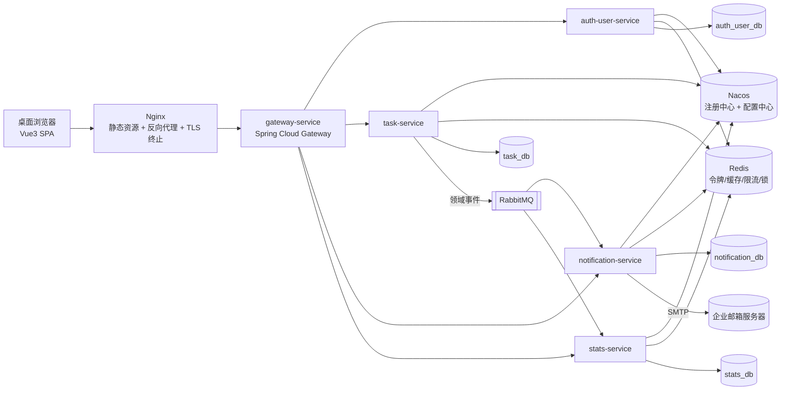

# TaskFlow 任务管理系统 架构设计文档

> 版本：v1.0 · 状态：待评审
> 关联 PRD：[`docs/PRD-任务管理系统-v1.0.md`](PRD-任务管理系统-v1.0.md)（v1.0 已终审通过，本文档为其技术落地设计）
> 关联选型：[`docs/项目skills选型.md`](项目skills选型.md)

---

## 1. 文档信息

### 1.1 阅读对象

| 读者 | 关注章节 |
|---|---|
| 架构师 | 全部 |
| 后端开发 | 2、3、4、5、6 |
| 前端开发 | 6、7 |
| 运维 | 2、6 |
| 测试 | 5、7 |

### 1.2 设计输入：决策基线

以下决策已在设计评审（brainstorming）中逐项确认，作为本文档的约束条件：

| # | 决策点 | 结论 |
|---|---|---|
| 1 | 部署环境 | 虚拟机裸部署 + Nacos（注册中心 + 配置中心） |
| 2 | 中间件 | PostgreSQL（分库）+ RabbitMQ + **Redis**（令牌 / 缓存 / 限流 / 分布式锁） |
| 3 | 定时任务归属 | 全部归 task-service（到期 / 逾期扫描 + 自动归档） |
| 4 | 统计策略 | 事件驱动增量聚合（消费者幂等） |
| 5 | 代码仓库 | Monorepo 单仓（Maven 多模块后端 + frontend/ 前端目录） |
| 6 | 前端组件库 | Element Plus（主题定制贴近原型视觉） |

PRD 侧既有约束（PRD 2.5、第 8 章）：Spring Cloud 微服务、Vue3 + TS、JWT + BCrypt、按服务分库、秒级最终一致。

---

## 2. 总体架构与部署拓扑

### 2.1 运行时拓扑



### 2.2 与 PRD 8.2 的差异说明

| # | 差异 | 说明 |
|---|---|---|
| 1 | 入口加 Nginx | 裸部署下由 Nginx 托管前端静态资源并反向代理 `/api` 到 Gateway，同时终止 TLS（PRD 7.3.6 允许内网网关终止 TLS） |
| 2 | 新增 Nacos | 服务注册发现 + 集中配置（SMTP 地址、附件存储路径、限流阈值等运行时配置）；密钥类（SMTP 凭据、JWT 密钥、数据库口令）仍走环境变量，不入 Nacos 明文 |
| 3 | 新增 Redis | 承担刷新令牌与令牌黑名单、权限矩阵与用户快照缓存、接口限流计数、定时任务分布式锁 |
| 4 | 定时任务归 task-service | 到期 / 逾期扫描结果通过 RabbitMQ 事件通知 notification-service 发送；notification-service 不再直接扫描任务数据（PRD 8.1 中"提醒定时任务"的执行端调整，通知触达行为不变） |

### 2.3 实例规划

一期每服务单实例部署即可满足 99.5% 可用性（内网系统，RTO 4 小时允许人工重启恢复）。但所有服务**按可无状态水平扩展设计**：会话在 Redis、锁在 Redis、无本地缓存依赖，后续增加实例不需要改代码。

### 2.4 附件存储的水平扩展预案

task-service 的附件按 PRD 4.1.6 存于**服务所在虚拟机的本地文件系统**（存储路径走 Nacos 配置，落盘文件名用 UUID），元数据存 `task_db.task_attachment` 表。这是 2.3"无状态水平扩展"承诺的**唯一例外**：task-service 若扩到多实例，A 实例上传的文件经负载均衡到 B 实例下载会 404。

- **一期**：单实例部署，问题不暴露，保持本地文件系统的简单设计。
- **扩展时预案（二选一）**：为所有实例挂载 **NFS 共享盘**；或迁移到**对象存储**（MinIO / 企业已有 OSS）。
- **迁移保护**：附件访问统一走 `GET /api/attachments/{id}/download` 接口，不直接暴露文件路径；更换存储介质时仅改动 task-service 内部存储实现，前端与调用方无感。

---

## 3. 服务职责与数据边界

### 3.1 服务职责

| 服务 | 职责 | 拥有的数据（唯一写者） | 对外能力 |
|---|---|---|---|
| gateway-service | 路由转发、JWT 校验（验签 + Redis 黑名单检查）、限流、CORS | 无 | 统一入口，鉴权失败 401/403 在此拦截 |
| auth-user-service | 登录 / 注销 / 改密、用户 / 部门 / 角色 / 权限矩阵 CRUD、审计日志 | `auth_user_db`：department、user、role、role_permission、audit_log | REST 接口；权限矩阵与用户变更时刷新 Redis 缓存 |
| task-service | 任务 CRUD、状态机、时间线、评论、附件、子任务、日程、导入导出、**全部定时扫描**（到期 / 逾期 / 自动归档） | `task_db`：task、task_timeline、task_comment、task_attachment、import_batch、event_outbox | REST 接口 + 发布领域事件 |
| notification-service | 站内消息、邮件发送与重试、消息过期清理（180 天） | `notification_db`：notification、mail_record | REST 接口（消息列表 / 已读 / 未读数）；消费事件生成消息 |
| stats-service | 统计预聚合与查询 | `stats_db`：日粒度聚合表（按天 × 状态 / 优先级 / 处理人） | REST 接口（`GET /api/stats/overview`）；消费事件增量聚合 |

### 3.2 数据边界三条铁律（落实 PRD 8.4）

1. **唯一权威来源**：任务数据只有 task-service 能写；用户 / 角色数据只有 auth-user-service 能写。其他服务一律通过接口或事件获取，**禁止跨服务直连别人的数据库**。
2. **跨服务读用户信息的两种方式**：
   - 实时校验（如"处理人是否可担任"）：task-service 走 **OpenFeign 调 auth-user-service**；
   - 展示类信息（姓名、部门）：读 **Redis 中的用户快照缓存**（auth-user-service 在用户变更时刷新，替代 PRD 8.4 的 60 秒本地缓存方案，保证即时一致）。
3. **权限点校验在各服务本地完成**：JWT 携带角色键，角色 → 权限点映射从 Redis 读（auth-user-service 写）；权限矩阵变更即时生效，满足 PRD 验收条件"下一次请求即生效"。

### 3.3 领域事件清单

task-service 生产，全部走 RabbitMQ（topic exchange），事件 DTO 定义在 common 模块、字段只增不改：

| 事件 | 触发点 | 消费者 | 消费者动作 |
|---|---|---|---|
| task.assigned | 创建任务 / 创建子任务 | notification + stats | 通知处理人；聚合 +1 |
| task.transferred | 转派 | notification + stats | 通知新处理人；人员负载调整 |
| task.commented | 发表评论 | notification | 站内通知创建人与处理人（评论者除外） |
| task.acceptance.submitted | 提交验收 | notification | 通知创建人 |
| task.approved | 验收通过 | notification + stats | 通知处理人；状态聚合调整 |
| task.rejected | 验收驳回 | notification + stats | 通知处理人（含原因）；状态聚合调整 |
| task.status.changed | 受理 / 进度 / 归档等一切状态或字段变更 | stats | 增量维护聚合表（载荷含变更前后状态与关键字段） |
| task.due.soon | 定时扫描（每小时） | notification | 到期前 24h 提醒 |
| task.overdue | 定时扫描（每日 09:00） | notification | 逾期提醒（处理人 + 创建人） |

> 与 PRD 6.2 的关系：notification 关心的通知类事件保持 PRD 原样的语义化命名；stats 需要的变更统一收敛为 `task.status.changed` 一个通用事件，避免 stats-service 订阅多种事件做重复解析。

---

## 4. 关键链路数据流

### 4.1 登录与鉴权链路

1. 登录：auth-user-service 校验 BCrypt 密码（连续失败 5 次锁定 15 分钟，计数存 Redis），签发 JWT（2 小时，载荷含用户 id + 角色键）+ 刷新令牌（7 天，存 Redis）。
2. 之后每个请求：Gateway 验签 JWT → 查 Redis 黑名单（登出 / 改密后旧令牌立即失效的关键）→ 透传用户 id 与角色键到下游服务的请求头。
3. 下游服务：从请求头取角色键 → 查 Redis 的「角色 → 权限点」映射 → 本地完成权限点校验；任务类数据再由 task-service 执行 PRD 3.4 可见性过滤。
4. 权限矩阵修改：auth-user-service 写库 + 写审计日志 + 刷新 Redis 映射，下一次请求即生效。

### 4.2 任务状态流转链路（以"提交验收"为例）

task-service 单服务内完成：校验权限点（updateAssigned）→ 校验前置状态（进行中）与操作人（处理人）→ 校验无未完成子任务 → 同事务内更新任务 + 写时间线 → 事务提交后经本地消息表发布 `task.acceptance.submitted` → notification-service 消费后发站内消息 + 邮件给创建人。

### 4.3 定时任务链路（task-service）

| 任务 | 频率 | 逻辑 |
|---|---|---|
| 到期提醒扫描 | 每小时 | 查"未完成 且 到期时间 ∈ (now+23h, now+24h] 且未发过提醒"的任务，发 `task.due.soon`，并置已提醒标记（保证每任务仅一次） |
| 逾期提醒扫描 | 每日 09:00 | 查"未完成 且 已逾期"，发 `task.overdue`（扫描频率天然保证每日一次） |
| 自动归档 | 每日 | 已完成满 7 天 → 已归档 + 时间线写"自动归档" |
| 孤儿附件清理 | 每日 | 清理上传中断遗留、无数据库记录的存储文件 |

多实例防重：每个定时任务先取 **Redis 分布式锁**（SETNX + 过期时间），水平扩展后不会重复执行。

### 4.4 统计聚合链路

stats-service 消费 `task.status.changed` 等事件，对「天 × 状态 / 天 × 优先级 / 处理人」三组聚合表做增量 ±1 更新；查询接口按区间对聚合行求和，响应毫秒级，满足 PRD 统计接口 P95 ≤ 2 秒且禁止实时全表扫描的要求。事件消费者做**幂等处理**（事件带全局唯一 eventId，消费前查去重表）。

---

## 5. 错误处理与可靠性

| 场景 | 策略 |
|---|---|
| 事件丢失 | task-service 用**本地消息表**：事件与业务数据同事务落 `event_outbox` 表，后台线程轮询投递 RabbitMQ，失败重投 |
| 消息重复消费 | 消费者按 eventId 幂等去重 |
| 邮件发送失败 | notification-service 内重试 3 次（指数退避），仍失败写 mail_record 并告警系统管理员（PRD 4.6.3） |
| Feign 调用失败 | 实时校验类（如校验处理人）直接失败返回错误，不用降级数据放行（宁拒不错）；展示类读 Redis 缓存，不依赖实时调用 |
| 附件上传中断 | 临时文件校验完整后才写库；孤儿文件每日定时清理 |
| 定时任务重复执行 | Redis 分布式锁 + 业务幂等标记（如"已提醒"标记）双重保证 |
| 统一错误响应 | 全服务统一 `{ code, message, details }` 结构；业务错误码分段：1xxx 通用 / 2xxx 任务 / 3xxx 权限 / 4xxx 通知 |

---

## 6. Monorepo 工程结构

```
TaskFlow/
├── docs/                        # PRD、原型、架构设计文档（已有，继续沿用）
├── pom.xml                      # Maven 父 POM，统一依赖版本
├── gateway-service/             # Spring Cloud Gateway
├── auth-user-service/
├── task-service/
├── notification-service/
├── stats-service/
├── common/                      # 共享模块：统一错误响应、JWT 工具、事件 schema、Redis 工具
├── frontend/                    # Vue3 + Vite + TS + Pinia + Vue Router + Element Plus + ECharts
│   └── src/
│       ├── api/                 # 接口封装（按服务分文件，与后端契约对齐）
│       ├── stores/              # Pinia：当前用户、权限点、未读数
│       ├── views/               # 任务列表 / 统计总览 / 日程 / 权限管理 / 通知中心
│       └── components/          # 任务详情抽屉、时间线、评论区等业务组件
└── deploy/                      # Nginx 配置、服务启动脚本、初始化 SQL、Nacos 配置导出
```

要点：

1. **common 模块只放纯工具与契约**（错误码、事件载荷 DTO、JWT 解析），不放业务逻辑，避免服务间产生代码级耦合。
2. **事件 schema 版本化**：事件 DTO 放 common，字段只增不改，消费端向前兼容。
3. 前端 `api/` 与后端接口一一对应，接口设计文档定稿后先生成契约再开发。

---

## 7. 测试策略

对齐 PRD 第 10 章验收标准：

| 层 | 内容 | 工具 |
|---|---|---|
| 后端单元测试 | 状态机流转规则、权限点判定、可见性过滤、统计口径计算 | JUnit 5 + Mockito |
| 后端集成测试 | 每服务起真实 PG（Testcontainers），覆盖 API 清单的鉴权与可见性用例（越权返回 403 是重点） | Spring Boot Test + Testcontainers |
| 事件链路测试 | task 发事件 → notification / stats 消费的端到端用例（RabbitMQ Testcontainer） | Spring Boot Test |
| 前端测试 | 权限指令（按权限隐藏 / 禁用）、筛选逻辑、状态机按钮可用性 | Vitest + Vue Test Utils |
| 验收测试 | PRD 第 10 章 16 条验收条件逐条展开为接口级测试用例，作为一期验收依据 | REST Assured |

---

## 8. 实施顺序建议

架构设计之后的实施次序（供后续实施计划参考）：

1. 脚手架：父 POM + 5 服务空壳 + Nacos / Redis / RabbitMQ / PG 本地环境 + 前端工程
2. auth-user-service 全量（登录、用户、角色、权限矩阵、Redis 缓存）
3. task-service 核心（CRUD + 状态机 + 可见性 + 时间线）
4. notification-service + 事件链路打通
5. task-service 扩展（评论 / 附件 / 子任务 / 导入导出 / 日程）
6. stats-service + 定时任务
7. 前端按模块跟进（登录 → 任务列表 → 详情抽屉 → 统计 → 日程 → 权限）

---

## 9. 后续文档计划

| 文档 | 内容 | 依据 |
|---|---|---|
| 接口设计文档 | PRD 6.1 清单的请求 / 响应 schema、错误码细化、OpenAPI 接入鉴权设计 | api-design-principles 技能 |
| 库表设计文档 | 12 实体 + event_outbox + stats 聚合表的 PostgreSQL schema、索引、约束 | postgresql-table-design 技能 |
